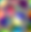

# Image file samples

This repository provides small, synthetic image files generated with the
[imagecodecs](https://github.com/cgohlke/imagecodecs) and
[tifffile](https://github.com/cgohlke/tifffile) libraries
using various options:

- formats: APNG, AVIF, BMP, GIF, HEIF, JPEG, JPEG LL, JPEG 2000, JPEG LS, 
  JPEG XL, JPEG XR, LERC, PNG, QOI, RGBE, TIFF, WebP, ZFP
- compression: Deflate, LZMA, LZW, PackBits, ZStandard
- data types: unsigned and signed integer, floating point
- bit depths: 8, 16, 24, 32, 64-bit
- color spaces: grayscale, RGB, CMYK
- alpha and extra-samples
- contiguous and planar sample configurations
- striped, tiled, and volumetric storage
- single and multi-frame

The files are made available for testing and to demonstrate capabilities of 
the image file formats as well as the imagecodecs and tifffile libraries.